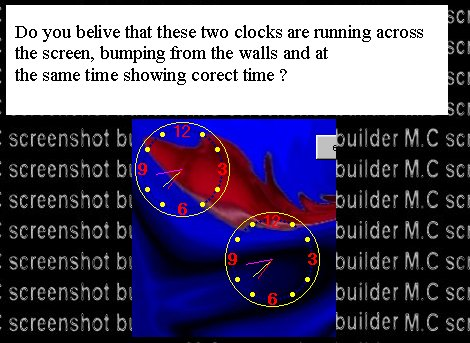



## McAnalogClock

### Description

Analog clock: Only picbox and one line of

code needed.No other controls.

Cool example included.
 
### More Info
 

             |
---                |---
**Submitted On**   |1998-08-21 03:51:52
**By**             |[M\.C](https://github.com/Planet-Source-Code/PSCIndex/blob/master/ByAuthor/m-c.md)
**Level**          |Advanced
**User Rating**    |4.0 (8 globes from 2 users)
**Compatibility**  |VB 6\.0
**Category**       |[Miscellaneous](https://github.com/Planet-Source-Code/PSCIndex/blob/master/ByCategory/miscellaneous__1-1.md)
**World**          |[Visual Basic](https://github.com/Planet-Source-Code/PSCIndex/blob/master/ByWorld/visual-basic.md)
**Archive File**   |[CODE\_UPLOAD88428112000\.zip](https://github.com/Planet-Source-Code/m-c-mcanalogclock__1-10598/archive/master.zip)

